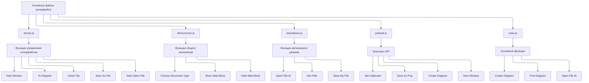

основные файлы и функции, формирующие интерфейс программы DrakonHub. На основе предоставленного кода я вижу следующие ключевые компоненты:

Основные файлы интерфейса:

1. **drcore.js** (`/src/static/js/drcore.js`) - содержит основные функции управления интерфейсом  
   - `newWindow()` - создание нового окна  
   - `toDiagram()` - переход к диаграмме  
   - `closeFile()` - закрытие файла  

2. **dh2common.js** (`/src/static/js/dh2common.js`) - общие функции интерфейса  
3. **standalone.js** (`/src/static/js/standalone.js`) - функции автономного режима  
4. **preload.js** (`/src/preload.js`) - мост между Electron и интерфейсом  
5. **main.js** (`/src/main.js`) - основные функции приложения

Для добавления новых панелей вам нужно будет работать в основном с файлом drcore.js, который содержит основные функции управления интерфейсом.

        